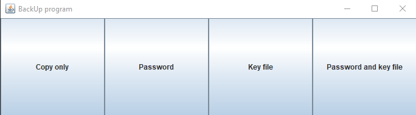
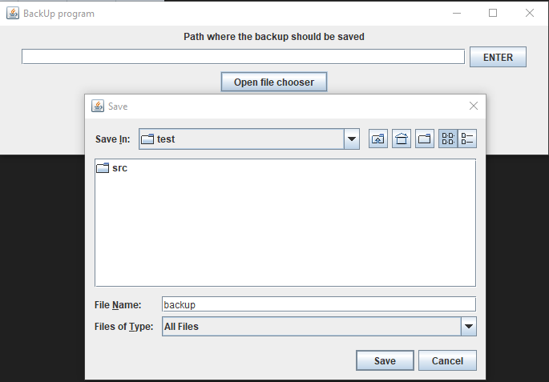
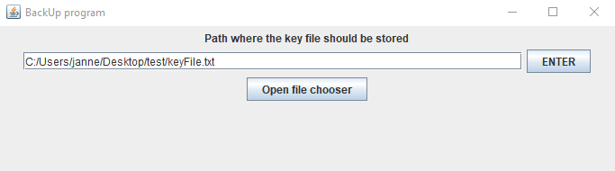
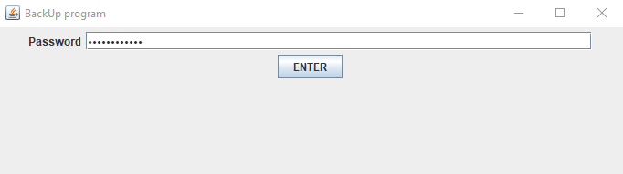
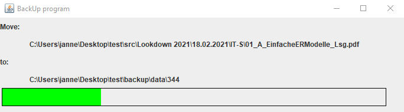

# BackUp
Create a encrypted backup with a fast update mode.
 
The update mode only copies new and changed files.
<h2>Speed Copy</h2>
- My program: 12.9s for 3.1GB 
- Windows:    24.5s for 3.1GB
<h2>Speed encryption</h2>
- My program: 12.5s for 3.1GB 
- win rar:    1min 17.7s for 3.1GB
 
But the speed has its price. I don't use any key expansion or compression algorithms.
But for me is speed more important because a backup is something
you store on a external HDD on a save place.
Secret data should be encrypted stored all the time.
So it would make no sence to use a super secure encryption.
 
<h1><u>How to use</u></h1>
These are the back-up options.
 

 
You can choose the target path with a file cooser or copy the path into it.
 

 

 
Set a password.
 

 
The missing data will now be determined.
 

 
The last thing to do is to create the backup. Then the window closes.
 

